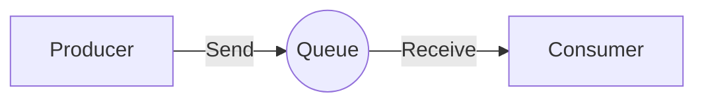
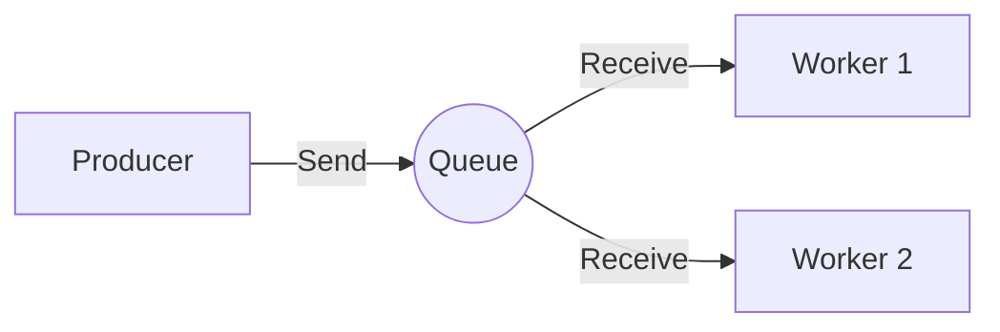
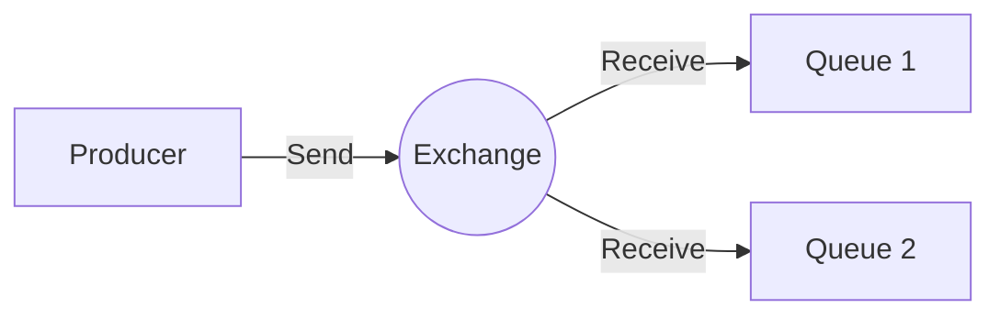
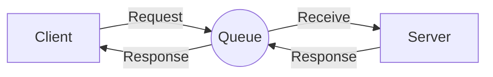

# RabbitMQ Tutorial in Kotlin

This is a [RabbitMQ](https://www.rabbitmq.com/) tutorial in Kotlin. It is based on the [official RabbitMQ tutorial](https://www.rabbitmq.com/tutorials) and is written in Kotlin.

## Requirements
- [RabbitMQ](https://www.rabbitmq.com/download.html)
- [Kotlin](https://kotlinlang.org/docs/tutorials/command-line.html) 
- [Gradle](https://gradle.org/install/)

## Contents
- [Hello World](src/main/kotlin/helloWorld) Basic example of sending and receiving messages.

- [Work Queues](src/main/kotlin/workQueues) Distributing tasks among workers.

- [Publish/Subscribe](src/main/kotlin/pubSub) Sending messages to multiple consumers.

- [Routing](src/main/kotlin/routing) Receiving messages selectively.

- [Topics](src/main/kotlin/topics) Receiving messages based on a pattern.

- [RPC](src/main/kotlin/rpc) Request/Response pattern.

- [Publisher Confirms](src/main/kotlin/publisherConfirms) Ensuring messages are received by the broker.

## Running the examples
1. Clone the repository
2. Navigate to the example you want to run
3. Run the consumer(with arguments if needed)
4. Run the producer(with arguments if needed)
5. Observe the output
